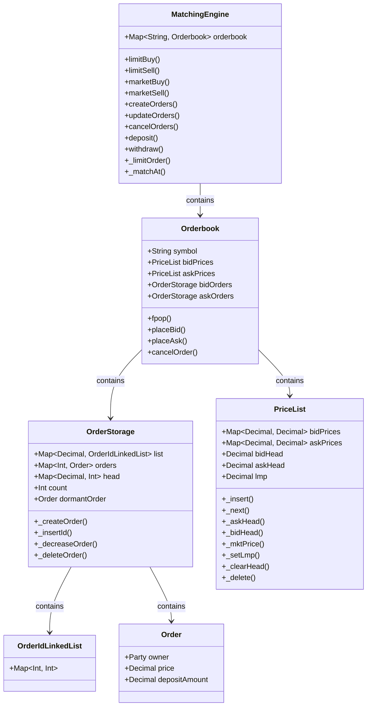

[](https://github.com/digital-asset/daml/blob/main/LICENSE)

# tempest-clob-daml

fully onchain CLOB on DAML from [solidity version]()

## Overview 


The matching engine is one big state machine data type defined in DAML. Template in DAML will create new contract whenever the state of the matching engine changes from its methods. 

## Private transactions

As the orders in the matching engine is accessed through one shared public key, a private account to mix all users who needs privacy is needed. A separate template contract from DAML is used to record user's balances before submitting order commands to matching engine contract is being developed.  

## Development Quick Start

You need to have [Node.js] and [Daml] installed.

[Node.js]: https://nodejs.dev
[Daml]: https://docs.daml.com

First, start the Daml components:

```bash
daml start
```

This will:

- Build you Daml code once.
- Generate JavaScript code (and TypeScript definitions) for your Daml types.
- Start a Daml sandbox gRPC server (on 6865).
- Start a Daml HTTP JSON API server (on 7575).
- Watch for the `r` key press (`r` + Enter on Windows); when pressed, rebuild
  all of the Daml code, push the new DAR to the ledger, and rerun the JS/TS
  code generation.

Next, start the JS dev server:

```bash
cd ui
npm install
npm start
```

This starts a server on `http://localhost:3000` which:

- Builds all of your TypeScript (or JavaScript) code (including type
  definitions from the codegen).
- Serves the result on :3000, redirecting `/v1` to the JSON API server (on
  `127.0.0.1:7575`) so API calls are on the same origin as far as your browser
  is concerned.
- Watch for changes in TS/JS code (including codegen), and immediately rebuild.

## Deploying to Daml Hub

To build everything from scratch:

```bash
daml build
daml codegen js .daml/dist/create-daml-app-0.1.0.dar -o ui/daml.js
cd ui
npm install
npm run-script build
zip -r ../create-daml-app-ui.zip build
```

Next you need to create a ledger on [Daml Hub], upload the files
`.daml/dist/create-daml-app-0.1.0.dar` (created by the `daml build` command)
and `create-daml-app-ui.zip` (created by the `zip` command based on the result
of `npm run-script build`).

[Daml Hub]: https://hub.daml.com

Once both files are uploaded, you need to tell Daml Hub to deploy them. A few
seconds later, your website should be up and running.
